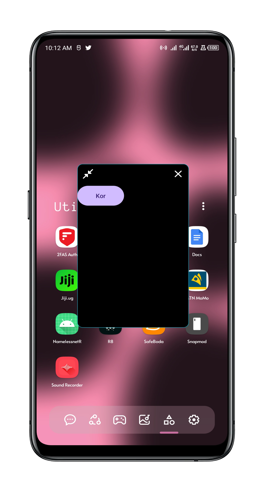
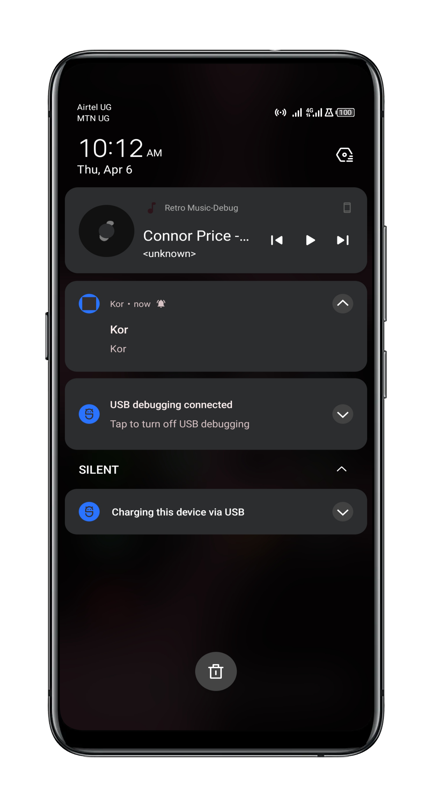
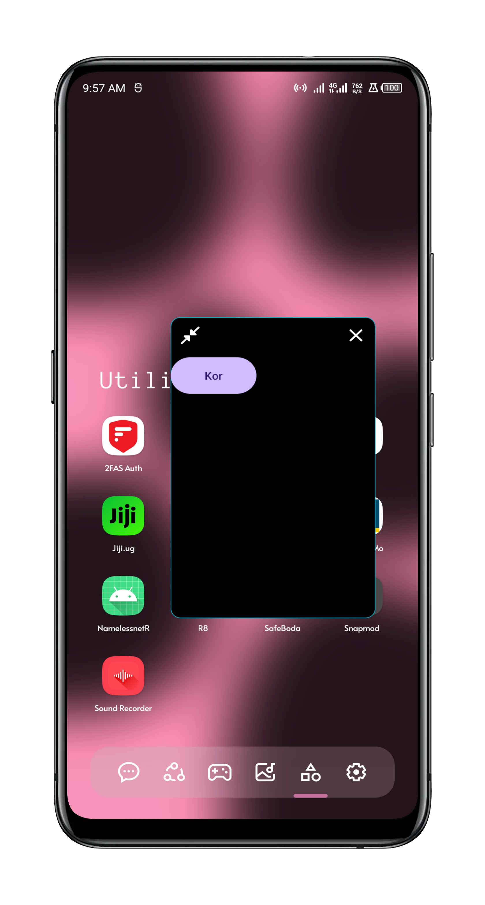

# Kor
Kor is a floating windows sample code written in kotlin for standout windows aka floating windows applications basically a fully floating android application , this supports Android 11, Android 12 and Android 13

# Usage 

```

```

# Screen shots

<div style="display:flex; flex-wrap:wrap;">
    <div style="flex:1; display:flex; flex-direction:column; padding:5px;">
        
        
        
    </div>
</div>
